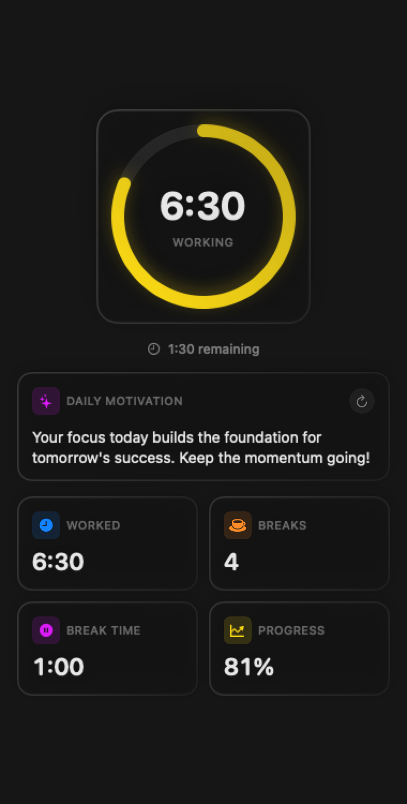

<p align="center">
  
</p>

<h1 align="center">worK</h1>

<p align="center">
  <strong>Automatic work time tracking that lives in your menu bar.</strong>
  <br />
  Lock your screen to take a break. Unlock it to get back to work. That's it.
</p>

<p align="center">
  <a href="#installation">Installation</a> &bull;
  <a href="#features">Features</a> &bull;
  <a href="#how-it-works">How It Works</a> &bull;
  <a href="#architecture">Architecture</a> &bull;
  <a href="#building-from-source">Building</a> &bull;
  <a href="#contributing">Contributing</a>
</p>

<p align="center">
  
  
  
  
</p>

---

<p align="center">
  
</p>

<p align="center">
  <sub>Glass-morphic dashboard with real-time progress tracking, stats cards, and AI-powered motivational messages.</sub>
</p>

## Why worK?

Most time-tracking tools demand your attention. They need you to remember to start a timer, switch projects, or fill out timesheets. **worK takes a different approach: it gets out of your way.**

Your computer already knows when you're working -- the screen is on. It knows when you're on break -- the screen is locked. worK simply watches for those signals and builds an accurate picture of your work day, automatically.

- **Zero friction.** No buttons to press, no timers to start. Open your laptop and work.
- **Privacy first.** All data stays on your machine in a local SQLite database. No accounts, no cloud, no telemetry.
- **Beautifully minimal.** A single menu bar icon shows your remaining hours. Click it for the full dashboard.

## Features

### Automatic Time Tracking

worK observes macOS screen lock and unlock events to track your work and break sessions automatically. When you unlock your screen, work begins. When you lock it, a break starts. No manual intervention required.

```
Screen unlocked  -->  Working (auto-start/resume)
Screen locked    -->  On Break (auto-pause)
```

### Take a Break

A single button locks your screen and starts a break timer. When you return and unlock, work resumes seamlessly.

<p align="center">
  
</p>

### Glass-Morphic Dashboard

The popover interface features a Control Center-inspired design with:

- **Progress circle** -- Animated ring that fills as you approach your daily target
- **Stats cards** -- Worked time, break count, total break time, and progress percentage
- **AI messages** -- Context-aware motivational messages and registration reminders
- **Color-coded status bar** -- Green (on track), yellow (behind), red (just started), gray (idle)

<p align="center">
  
</p>

<p align="center">
  <sub>Four tabs: Dashboard for real-time tracking, Charts for monthly patterns, History for past days, and Settings for configuration.</sub>
</p>

### Monthly Charts

Visualize your work patterns over time with a monthly chart view that shows daily hours worked, helping you identify trends and maintain consistency.

### Work History

Browse past work days with detailed breakdowns of each session, including start times, end times, and total durations.

### Flexible Configuration

| Setting | Description | Default |
|---------|-------------|---------|
| Daily target | Hours you aim to work each day | 8.0h |
| Break reminders | Periodic notifications to take breaks | Every 60 min |
| Auto-stop | Automatically stop tracking at a set time | 8:00 PM |
| Launch at login | Start worK when you log in | Off |
| Registration reminders | Remind to log completed work externally | On |

## Installation

### Download

Download the latest `.dmg` from the [Releases](https://github.com/jonathapereiralima/worK/releases) page.

1. Open `worK-1.0.0.dmg`
2. Drag **worK** to your Applications folder
3. Launch worK from Applications
4. The app appears in your menu bar -- no dock icon

### Homebrew (coming soon)

```bash
brew install --cask work
```

## How It Works

worK listens for macOS distributed notifications to detect screen state changes:

```
com.apple.screenIsLocked    -->  End work session, start break
com.apple.screenIsUnlocked  -->  End break, start/resume work
```

**On launch**, worK checks if your screen is unlocked and automatically begins tracking. A 60-second timer keeps the status bar and dashboard up to date.

**The status bar** displays your remaining time in `H:MM left` format with a color indicator:

| Color | Meaning |
|-------|---------|
| :green_circle: Green | 90%+ of target reached |
| :yellow_circle: Yellow | 50-90% of target reached |
| :red_circle: Red | Under 50% of target |
| :white_circle: Gray | Idle / not tracking |

**Data storage** uses a local SQLite database at:

```
~/Library/Application Support/worK/worK.sqlite
```

No data ever leaves your machine.

## Architecture

worK follows an **MVVM architecture** with dependency injection, leveraging modern Swift concurrency and the Observation framework.

```
worK/
 |
 |-- App/
 |    |-- worKApp.swift              # Entry point, database bootstrap
 |    +-- AppDelegate.swift          # StatusBar + ReminderService init
 |
 |-- StatusBar/
 |    |-- StatusBarController.swift   # NSStatusItem, popover management
 |    +-- PopoverContentView.swift    # Tab container (Dashboard, Chart, History, Settings)
 |
 |-- Features/
 |    |-- Dashboard/
 |    |    |-- DashboardView.swift    # Progress circle, stats grid
 |    |    |-- StatsCardView.swift    # Reusable stat card component
 |    |    +-- AIMessageView.swift    # Motivational / reminder messages
 |    |
 |    |-- Tracking/
 |    |    |-- WorkDayViewModel.swift # Core state manager (@Observable)
 |    |    +-- TrackingState.swift    # .idle, .working, .onBreak, .completed
 |    |
 |    |-- Chart/
 |    |    |-- MonthlyChartView.swift
 |    |    +-- MonthlyChartViewModel.swift
 |    |
 |    |-- History/
 |    |    |-- HistoryView.swift
 |    |    |-- HistoryViewModel.swift
 |    |    +-- WorkDayDetailView.swift
 |    |
 |    |-- Reminder/
 |    |    |-- ReminderService.swift
 |    |    |-- ReminderPanelController.swift
 |    |    +-- ReminderOverlayView.swift
 |    |
 |    +-- Settings/
 |         +-- SettingsView.swift     # Configuration UI
 |
 |-- Database/
 |    |-- AppDatabase.swift           # Schema, migrations
 |    |-- Models/
 |    |    |-- WorkDay.swift          # One record per calendar day
 |    |    |-- WorkSession.swift      # Work period timestamps
 |    |    +-- BreakSession.swift     # Break period timestamps
 |    +-- Queries/
 |         |-- WorkDayQueries.swift   # Database query methods
 |         +-- DailySummary.swift     # Aggregated daily stats
 |
 |-- Dependencies/
 |    |-- DatabaseBootstrap.swift     # Database initialization
 |    |-- NotificationClient.swift    # Screen lock/unlock events
 |    |-- ScreenLockClient.swift      # Programmatic screen lock
 |    |-- SettingsClient.swift        # UserDefaults wrapper
 |    +-- AIMessageClient.swift       # Motivational messages
 |
 +-- Shared/
      |-- Constants.swift             # App-wide constants
      +-- Extensions/
           |-- Date+Helpers.swift
           +-- TimeInterval+Formatting.swift
```

### Tech Stack

| Layer | Technology | Purpose |
|-------|-----------|---------|
| UI | SwiftUI + AppKit | Declarative views with menu bar integration |
| State | `@Observable` (Observation) | Reactive view model updates |
| Database | [SQLiteData](https://github.com/pointfreeco/sqlite-data) | Local SQLite persistence via GRDB |
| DI | [Swift Dependencies](https://github.com/pointfreeco/swift-dependencies) | Testable dependency injection |
| Concurrency | Swift Concurrency | `async/await`, `actor`, `AsyncStream` |
| Testing | [Swift Snapshot Testing](https://github.com/pointfreeco/swift-snapshot-testing) | Visual regression tests |
| Build | [XcodeGen](https://github.com/yonaskolb/XcodeGen) | Project generation from `project.yml` |

### Key Design Decisions

**No dock icon.** The app sets `LSUIElement = true` so it runs as a pure menu bar accessory. No window, no dock presence -- just an unobtrusive status item.

**Strict concurrency.** The project compiles with `SWIFT_STRICT_CONCURRENCY = complete`, catching data races at compile time. The main view model is `@MainActor`-isolated, and screen event observation uses `AsyncStream` for safe cross-boundary communication.

**Local-first privacy.** All data lives in a single SQLite file on disk. No network requests, no analytics, no accounts. Your work history is yours alone.

**Glass-morphic design.** The UI uses `.ultraThinMaterial` with layered backgrounds, gradient borders, and multi-depth shadows to create a translucent, depth-rich aesthetic inspired by macOS Control Center.

## Building from Source

### Requirements

- macOS 15.0+
- Xcode 16.0+
- Swift 6.0+

### Build

```bash
# Clone the repository
git clone https://github.com/jonathapereiralima/worK.git
cd worK

# Open in Xcode and run
open worK.xcodeproj
# Press Cmd+R to build and run

# Or build from the command line
xcodebuild -scheme worK -configuration Debug build
```

### Project Generation

The Xcode project is generated from `project.yml` using [XcodeGen](https://github.com/yonaskolb/XcodeGen):

```bash
# Install XcodeGen
brew install xcodegen

# Generate the Xcode project
xcodegen generate
```

### Running Tests

```bash
xcodebuild -scheme worK -configuration Debug test
```

The test suite includes snapshot tests for all major views (Dashboard, Charts, History, Settings).

## Contributing

Contributions are welcome. Here's how to get started:

1. **Fork** the repository
2. **Create a branch** for your feature (`git checkout -b feature/your-feature`)
3. **Commit** your changes with clear, descriptive messages
4. **Push** to your fork and open a **Pull Request**

### Guidelines

- Follow the existing code style and architecture patterns
- Maintain strict concurrency compliance (`SWIFT_STRICT_CONCURRENCY = complete`)
- Add snapshot tests for new or modified views
- Keep the menu bar-only philosophy -- no windows, no dock icon
- Respect the glass-morphic design language for UI changes

### Areas for Contribution

- Localization (the app uses `String(localized:)` and is ready for translation)
- Accessibility improvements (VoiceOver labels, keyboard navigation)
- Additional chart types and statistics
- Widget support for macOS desktop widgets
- Shortcuts integration for automation

## Roadmap

- [ ] **Widgets** -- Desktop widgets showing today's progress
- [ ] **Shortcuts** -- Apple Shortcuts actions for querying work data
- [ ] **Export** -- CSV/JSON export of work history
- [ ] **Weekly/Monthly reports** -- Summary views beyond daily tracking
- [ ] **Focus integration** -- Tie into macOS Focus modes
- [ ] **Pomodoro mode** -- Optional structured work/break intervals
- [ ] **Localization** -- Multi-language support
- [ ] **Homebrew distribution** -- `brew install --cask work`

## Acknowledgments

worK is built on the shoulders of excellent open-source libraries from [Point-Free](https://www.pointfree.co/):

- **[SQLiteData](https://github.com/pointfreeco/sqlite-data)** -- Type-safe SQLite access with GRDB
- **[Swift Dependencies](https://github.com/pointfreeco/swift-dependencies)** -- Lightweight, testable dependency injection
- **[Swift Snapshot Testing](https://github.com/pointfreeco/swift-snapshot-testing)** -- Visual regression testing

## License

worK is available under the MIT License. See the [LICENSE](LICENSE) file for details.

```
MIT License

Copyright (c) 2026 Jonatha Lima
```

---

<p align="center">
  <sub>Built with care for people who'd rather be working than tracking their work.</sub>
</p>
